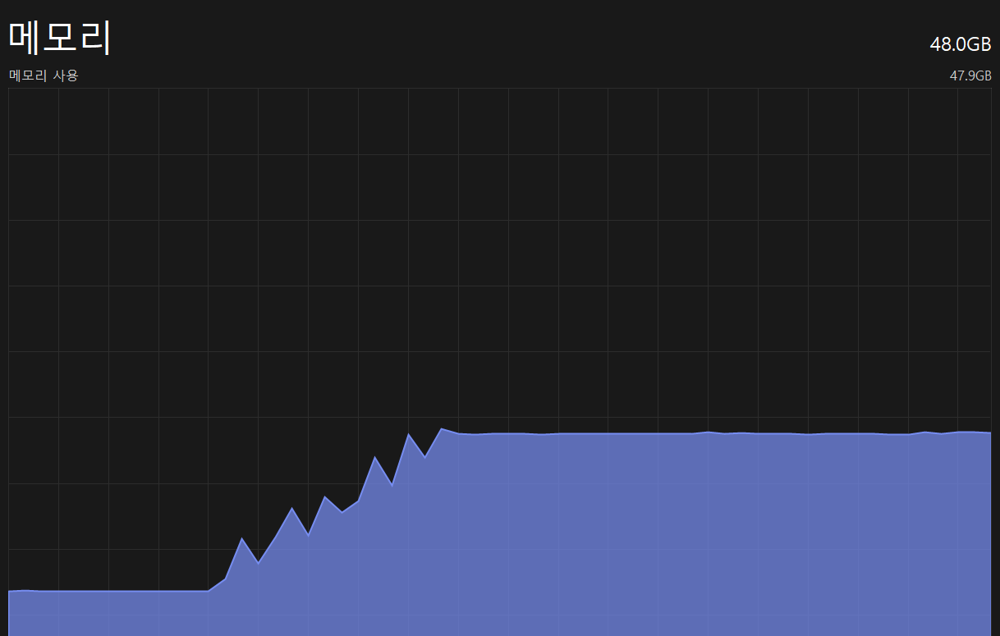

# 아직 개발 중이며, 실제 환경에서 사용하는 것을 권장하지 않습니다

_메모리와 SSD를 최대로 활용해보세요_

## Memory Copy
Memory Copy는 SSD -> HDD처럼 빠른 저장 장치에서 느린 저장 장치로의 파일 및 디렉터리 복사에 유용한 프로그램입니다.

### 장점
- 복사가 완료되기 전에 파일을 삭제할 수 있습니다. 용량 확보가 급한 상황에서 유용할 수 있습니다.

### 주의 사항
- 큰 메모리 용량을 요구합니다.
- 복사가 완료되기 전에 원본 파일을 삭제하는 것은 권장되지 않습니다.
- 힙 메모리의 크기는 최소 3기가 이상이어야 합니다.
- 할당된 메모리가 클수록 좋습니다

### 실행 방법
3GB  
```java -Xmx3G -jar MemoryCopy-1.0-SNAPSHOT.jar```

8G  
```java -Xmx8G -jar MemoryCopy-1.0-SNAPSHOT.jar```

12G  
```java -Xmx12G -jar MemoryCopy-1.0-SNAPSHOT.jar```

### TODO
- 읽기 완료 후 원본 파일 삭제
- 용량 부족과 같은 I/O 예외 처리
- 최적화
- 리팩토링